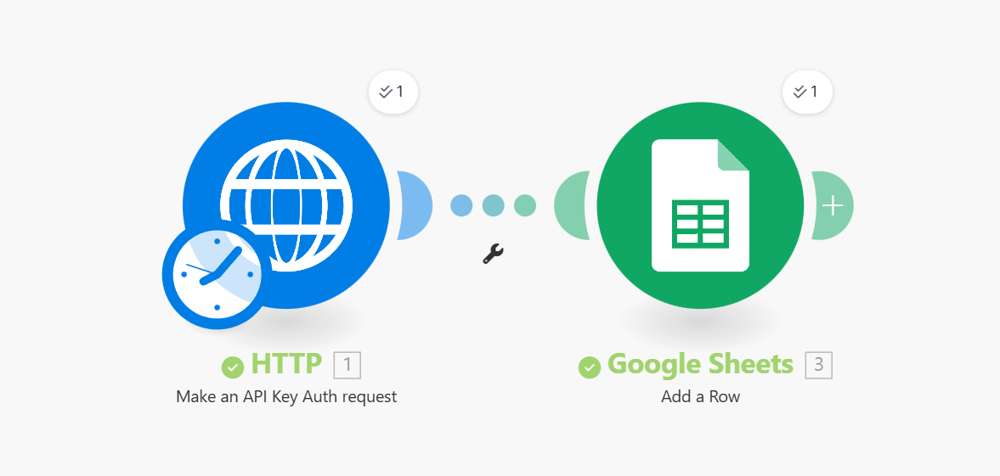

# API → Google Sheets Automation (Make.com Workflow)

## 📌 Overview
This project is an automated workflow built using **Make.com (formerly Integromat)** that:

1. Fetches data from any external API  
2. Transforms it (optional)  
3. Appends or updates rows inside Google Sheets  

No manual exports. No copy-paste. Fully automated.

---

## 🛠️ Tech Stack
- **Make.com** (visual automation platform)
- **HTTP Module** (API request)
- **JSON Parsing / Mapping**
- **Google Sheets Module**

---

## ⚙️ Workflow Diagram

> Make sure your image is named **workflow.png** and placed in the repo root.

---

## 🔄 Workflow Steps

### 1️⃣ Trigger
Can be:
- **Scheduled** (every hour/day)
- **Manual**
- **Webhook-driven**

### 2️⃣ HTTP Request Module
- Calls your API endpoint
- Supports:
  - Query params
  - Headers
  - Bearer tokens
  - API keys
  - Pagination

### 3️⃣ Data Parsing / Mapping
- Converts JSON fields into sheet-friendly structure
- (Optional) Field cleanup:
  - Combine fields
  - Rename keys
  - Format dates
  - Convert numbers

### 4️⃣ Google Sheets Module
- **Append Row**
- or **Update Existing Row**
- Maps API values to sheet columns

---

## 📦 Setup Instructions

### Prerequisites
- Make.com account
- Google Sheets access
- API URL + key/token (if required)
- A Google Sheet with headers created

### Steps
1. Create a new scenario in Make.com  
2. Add an **HTTP** module → GET your API  
3. Connect it to **Google Sheets** → Add row  
4. Map JSON values → Sheet columns  
5. Turn on scheduling / activate your scenario  

---

## 🧪 Testing Checklist
- Run scenario once manually
- Check Google Sheet updates
- Verify values match API response JSON
- Test with different API inputs

---

## 🚀 Automation Ideas
- Run every 1 hour for live dashboards
- Daily sync for reporting sheets
- Multi-sheet output for grouped data
- Auto-color-code cells based on values

---

## 🛡️ Error Handling (Optional)
Add:
- **Error Handlers**
- **Notifications (Slack / Gmail)**
- **Backup sheet module**
- **Retries for failed API calls**

---

## 💡 Common Use Cases
- Fetch crypto or stock prices → Google Sheets
- Sync CRM or sales data into sheets
- Pull marketing metrics (FB, GA, Ads)
- Weather or public API monitoring
- Track product or competitor prices

---

## ✨ Future Enhancements
- Push data into BigQuery
- Visualize in Looker Studio / Power BI
- Merge with existing data automatically
- Create version history sheets

---

## 📄 License
MIT — free to use, modify, and share.
