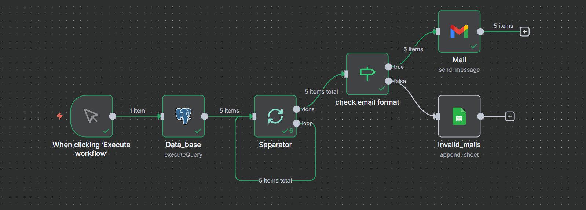

# HR Email Outreach Automation (n8n + PostgreSQL)

This project automates personalized email outreach using **n8n**, **PostgreSQL**, **Gmail**, and a Google Drive resume link. The workflow validates email addresses, sends personalized emails in batches, logs invalid emails, and updates statuses.

---

## 📌 Workflow Overview
Below is the workflow you create in n8n:



> Replace `./workflow.png` with your actual image file name after uploading.

---

## 🚀 Features
- Fetches contacts from PostgreSQL (`hr_emails` table)
- Processes data **one row at a time** using Split In Batches
- Validates email format with regex
- Sends personalized Gmail messages with a Google Drive resume link
- Logs invalid emails in Google Sheets
- Updates status back into PostgreSQL

---

## 🗄️ Database Structure (`hr_emails`)
| Column   | Type |
|----------|------|
| name     | text |
| email    | text |
| title    | text |
| company  | text |

### Optional tracking columns (recommended):
```sql
ALTER TABLE public.hr_emails
ADD COLUMN IF NOT EXISTS is_valid boolean DEFAULT TRUE,
ADD COLUMN IF NOT EXISTS last_sent_at timestamptz,
ADD COLUMN IF NOT EXISTS reason text;
