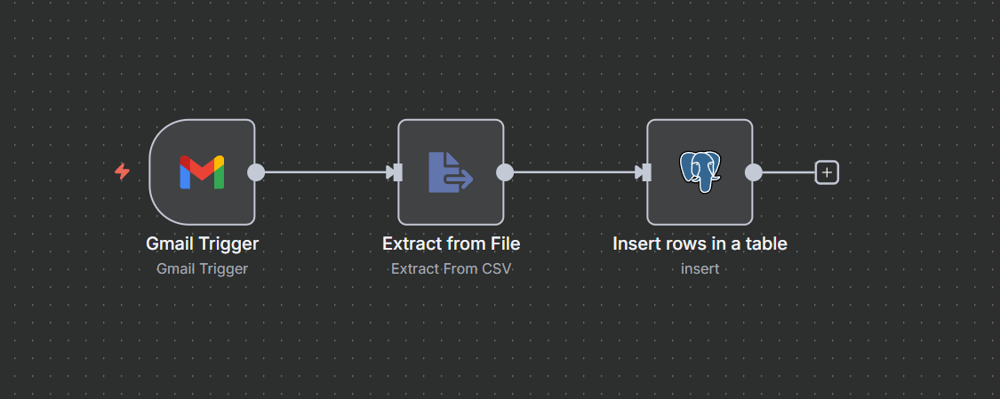

# Gmail → PostgreSQL Automation (n8n Workflow)

## 📌 Overview
This project is an automated workflow built using **n8n** that:
1. Listens for incoming emails in Gmail
2. Automatically extracts CSV attachments
3. Parses the rows into structured data
4. Inserts the rows into a PostgreSQL table — no manual effort required

This is useful for:
- Automated reporting
- Data ingestion pipelines
- Scheduled CSV uploads via email
- Reducing manual database update tasks

---

## 🛠️ Tech Stack
- **n8n** (low-code automation)
- **Gmail Trigger** (IMAP email listening)
- **Extract From File** (CSV parser)
- **PostgreSQL Node** (database insert)

---

## ⚙️ Workflow Diagram

> Make sure you save the image above as `workflow.png` in your repo for it to render properly.

---

## 🔄 Flow Breakdown

### 1️⃣ Gmail Trigger
- Watches a Gmail inbox
- Triggers when a new email arrives
- Can be filtered (subject, sender, attachment type, etc.)

### 2️⃣ Extract From File (CSV)
- Reads the attachment
- Converts CSV → JSON
- Each row becomes an item

### 3️⃣ Insert Rows in PostgreSQL
- Maps each column to your DB table fields
- Inserts each row automatically
- Supports custom fields & schema

---

## 📦 Setup Instructions

### Prerequisites
- n8n installed (self-hosted or cloud)
- Gmail account with IMAP access
- PostgreSQL database + credentials
- CSV files with proper headers

### Steps:
1. Import the n8n workflow JSON
2. Create Gmail OAuth Credentials in n8n
3. Create PostgreSQL credentials in n8n
4. Update column mappings in the **Insert** node
5. Activate the workflow — you're live 🚀

---

## 🧪 Testing
- Send yourself an email with a CSV file
- Wait for the workflow to trigger
- Check your PostgreSQL table
- Verify that rows were inserted

---

## 🛡️ Error Handling (Optional Enhancements)
You can extend this workflow with:
- Email notification on DB failure
- CSV validation checks
- Move processed emails to a label/folder
- Upsert logic (avoid duplicates)

---

## 📁 Example Use Cases
- Daily sales report → database
- HR team sending employee CSV updates
- IoT or device logs sent via email
- Customer orders syncing via email

---

## ✨ Future Improvements
- Support Excel (.xlsx) parsing
- Deduplicate rows
- Log ingestion history
- Add Slack or Discord confirmation message

---

## 📄 License
MIT — free to use and modify.
